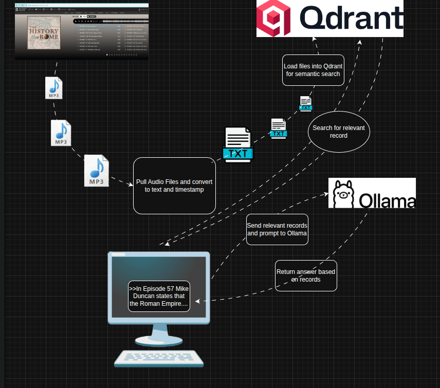

# History of Rome Podcast LLM

A comprehensive toolkit for downloading, transcribing, and processing Mike Duncan's acclaimed "The History of Rome" podcast series for use with Large Language Models and vector databases.



## Overview

This project provides a complete pipeline for converting the entire History of Rome podcast series (179 episodes + updates) into searchable, timestamped transcripts that can be used with modern LLM applications. The workflow includes automatic downloading, AI-powered transcription, and preparation for vector database integration.

## Features

### 🎧 **Podcast Download**
- Automatically scrapes and downloads all 192 MP3 files from Archive.org
- Progress tracking and resume capability
- Organized file naming with episode dates and titles

### 🎙️ **AI Transcription**
- **CPU & GPU Support**: Optimized for both CPU and CUDA-enabled GPUs
- **High-Quality Models**: Uses OpenAI's Whisper via faster-whisper for accuracy
- **Timestamped Output**: Every transcript includes precise timestamps
- **Batch Processing**: Handles the entire series automatically
- **Error Recovery**: Robust handling of failures with detailed logging

### 📚 **LLM Integration Ready**
- **Structured Format**: Clean, consistent transcript format
- **Vector Database Compatible**: Ready for Qdrant, Pinecone, or similar
- **Semantic Search**: Enables powerful content discovery
- **Episode Metadata**: Includes duration, language detection, and model info

## Dataset Information

The complete History of Rome series covers:
- **179 main episodes** (2007-2012): From Rome's founding to the fall of the Western Empire
- **13 additional episodes**: Updates, announcements, and special content
- **~150+ hours** of audio content
- **Comprehensive coverage**: 1,200+ years of Roman history

### Episode Range
- **Episodes 1-179**: The complete chronological history
- **Episode 1**: "In the Beginning" (753 BC - Founding of Rome)
- **Episode 179**: "The End" (476 AD - Fall of Western Roman Empire)
- **Special Episodes**: Updates and transitions to other series

## Quick Start

### 1. Download Episodes
```bash
jupyter notebook pull_episodes.ipynb
```
This will download all 192 MP3 files (~1.2GB total) to the `history_of_rome_episodes/` directory.

### 2. Transcribe Episodes

#### Option A: Jupyter Notebook (Recommended)
```bash
jupyter notebook parse_episodes.ipynb
```

#### Option B: Python Script (GPU Optimized)
```bash
python gpu_parser.py
```

### 3. Access Transcripts
Transcripts are saved in:
- `episode_transcripts/` - CPU-generated transcripts
- `gpu_transcripts/` - GPU-generated transcripts (faster)

## Transcript Format

Each transcript includes:
```
# 20070728 - 001- In the Beginning
# Detected language: en
# Duration: 708.10 seconds
# Model: medium, Device: cpu

[00:02 --> 00:05] Hello, and welcome to the History of Rome.
[00:06 --> 00:09] The founding of Rome is an event wrapped in myth.
[00:10 --> 00:14] Lacking a credible historical record, it is impossible to know exactly...
```

## Performance

### CPU Transcription
- **Speed**: ~0.5-1x real-time (30min episode = 30-60min)
- **Total Time**: ~384 hours for complete series
- **Memory**: ~2-4GB RAM required

### GPU Transcription (CUDA)
- **Speed**: ~2-4x real-time (30min episode = 7-15min)
- **Total Time**: ~96 hours for complete series
- **Memory**: ~4-8GB VRAM required

## Requirements

### Python Dependencies

**Main Project** (`requirements-main.txt`):
```
faster-whisper    # AI transcription
torch            # ML framework
requests         # HTTP downloads
beautifulsoup4   # HTML parsing
jupyter          # Notebooks
```

**Qdrant Service** (`requirements.txt`):
```
qdrant-client         # Vector database
sentence-transformers # Embeddings
torch                # ML framework
```

### System Requirements
- **Storage**: 2GB+ free space
- **RAM**: 4GB+ (8GB+ recommended)
- **GPU**: NVIDIA GPU with CUDA support (optional, for faster processing)
- **Docker**: For the easiest setup with Qdrant integration

## Installation

1. **Clone the repository**
```bash
git clone <repository-url>
cd history_of_rome_podcast_llm
```

2. **Install dependencies**
```bash
# Easy way with Makefile
make install-deps

# Or manually:
pip install -r requirements-main.txt  # Main project
pip install -r requirements.txt       # Qdrant only
```

3. **Run the notebooks**
```bash
jupyter notebook
```

## Directory Structure

```
history_of_rome_podcast_llm/
├── README.md                          # This file
├── images/
│   └── DataFlow.gif                   # Project workflow diagram
├── pull_episodes.ipynb               # Episode download notebook
├── parse_episodes.ipynb              # CPU transcription notebook
├── gpu_parser.py                     # GPU transcription script
├── history_of_rome_episodes/         # Downloaded MP3 files (192 files)
├── all_transcripts/                  # All generated transcripts
└── processed/                        # Additional processed files
```

## Vector Database Integration

The transcripts are designed for easy integration with vector databases:

### Qdrant Example
```python
# Load transcripts into Qdrant for semantic search
from qdrant_client import QdrantClient

client = QdrantClient("localhost", port=6333)
# Process transcripts and create embeddings
# Enable queries like: "In Episode 57 Mike Duncan states that the Roman Empire..."
```

### Supported Use Cases
- **Historical Q&A**: Answer questions about specific events, people, or periods
- **Episode Discovery**: Find relevant episodes by topic or theme  
- **Content Analysis**: Analyze historical patterns and themes
- **Educational Tools**: Create study guides and learning materials

## Contributing

Contributions are welcome! Areas for improvement:
- Additional preprocessing options
- Integration examples with popular vector databases
- Performance optimizations
- Support for other podcast series

## License

This project is for educational and research purposes. The original podcast content is created by Mike Duncan and available under his licensing terms.

## Acknowledgments

- **Mike Duncan**: Creator of The History of Rome podcast
- **OpenAI**: Whisper speech recognition model
- **Faster-Whisper**: Optimized Whisper implementation
- **Archive.org**: Hosting the podcast archive

## Docker Setup (Recommended)

For the easiest setup with Qdrant vector database integration:

### 1. Quick Start with Docker
```bash
# Clone and enter the repository
git clone <repository-url>
cd history_of_rome_podcast_llm

# Start the complete RAG system
make up

# Or alternatively:
docker-compose up
```

This will:
- 🚀 Start Qdrant vector database on `localhost:6333`
- 🤖 Start Ollama with GPU support on `localhost:11434`
- 📚 Parse all available transcripts and load into Qdrant
- 🔍 Generate embeddings using SentenceTransformers
- 🌐 Launch Flask web interface on `localhost:5000`
- 🧠 Pull and configure Llama 3.1 8B model

### 2. Ask Questions via Web Interface

Once running, open your browser to `http://localhost:5000` and ask questions like:

- **"What caused the fall of the Roman Republic?"**
- **"How did Julius Caesar rise to power?"** 
- **"What happened at the Battle of Cannae?"**
- **"How did Constantine change the Roman Empire?"**

The system will:
1. 🔍 Search relevant podcast segments using vector similarity
2. 📝 Provide context from timestamped transcripts  
3. 🤖 Generate comprehensive answers using Llama 3.1
4. 📚 Show sources with episode numbers and timestamps

### 3. API Access
```python
import requests

response = requests.post('http://localhost:5000/api/ask', json={
    'question': 'What happened at the Battle of Cannae?',
    'context_limit': 5
})

result = response.json()
print(result['answer'])
```

### 4. Configuration
Copy `.env.example` to `.env` and modify as needed:
```bash
cp .env.example .env
```

### Docker Services
- **Qdrant**: Vector database on ports 6333 (HTTP) and 6334 (gRPC)
- **Ollama**: LLM service with GPU support on port 11434
- **Flask App**: Web interface and API on port 5000
- **Transcript Loader**: One-time service to load transcripts into Qdrant
- **Persistent Storage**: Both Qdrant and Ollama data persist in Docker volumes

### Makefile Commands
The included Makefile provides easy management:
```bash
make help          # Show all available commands
make up            # Start the system
make down          # Stop the system
make logs          # View system logs
make health        # Check system health
make test          # Test with sample questions
make clean         # Clean up everything
```

### Manual Setup (Alternative)

If you prefer not to use Docker:

```bash
# Install dependencies
pip install -r requirements.txt  # For Qdrant integration
# OR
pip install -r requirements-main.txt  # For full project

# Start Qdrant manually
docker run -p 6333:6333 qdrant/qdrant:latest

# Load transcripts
python load_transcripts.py
```

## Vector Database Features

### Semantic Search Capabilities
- **Historical Events**: "What caused the fall of the Roman Republic?"
- **Key Figures**: "Tell me about Julius Caesar's rise to power"
- **Military Campaigns**: "How did Rome defeat Carthage?"
- **Specific Episodes**: Search within particular episodes or time periods

### Advanced Queries
```python
from utils import find_historical_figures, get_episode_summary

# Find all mentions of a historical figure
caesar_mentions = find_historical_figures(client, "history_of_rome", "Julius Caesar")

# Get episode summary
episode_44 = get_episode_summary(client, "history_of_rome", 44)  # "Caesar Triumphant"
```

### Complete RAG System Features
The system provides:
- **🧠 Intelligent Q&A**: Ask complex questions about Roman history
- **📍 Source Attribution**: Every answer includes episode references and timestamps
- **🔍 Semantic Search**: Find relevant content across 1000+ text segments
- **🎯 Context-Aware**: Understands historical context and relationships
- **⚡ GPU Acceleration**: Fast inference using your NVIDIA GPU
- **🌐 Web Interface**: Beautiful, responsive web interface
- **🔌 API Access**: RESTful API for integration with other tools

## Links

- [The History of Rome Podcast](http://thehistoryofrome.typepad.com/)
- [Mike Duncan's Website](https://mikeduncan.com/)
- [Archive.org Collection](https://archive.org/download/the-history-of-rome)
- [Whisper by OpenAI](https://openai.com/research/whisper)
- [Qdrant Vector Database](https://qdrant.tech/)

---

*"Hello, and welcome to the History of Rome..."* - Mike Duncan
