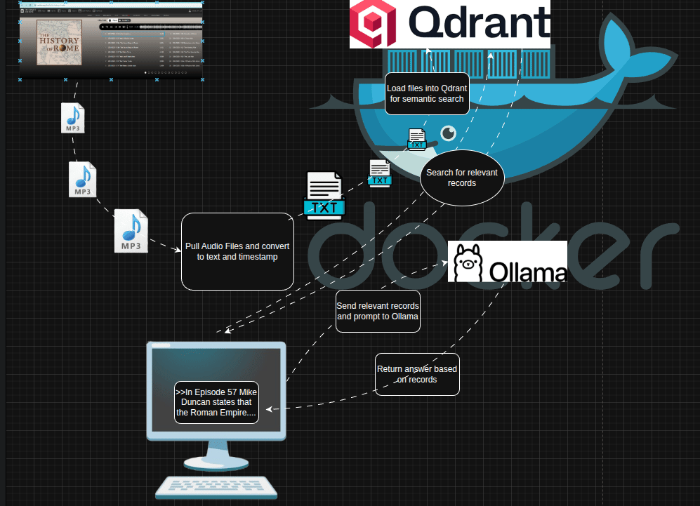

# History of Rome Podcast LLM

A comprehensive toolkit for downloading, transcribing, and processing Mike Duncan's acclaimed "The History of Rome" podcast series for use with Large Language Models and vector databases.



## Overview

This project provides a complete pipeline for converting the entire History of Rome podcast series (179 episodes + updates) into searchable, timestamped transcripts that can be used with modern LLM applications. The workflow includes automatic downloading, AI-powered transcription, and preparation for vector database integration.

## Features

### 🎧 **Podcast Download**
- Automatically scrapes and downloads all 192 MP3 files from Archive.org
- Progress tracking and resume capability
- Organized file naming with episode dates and titles

### 🎙️ **AI Transcription**
- **CPU & GPU Support**: Optimized for both CPU and CUDA-enabled GPUs
- **High-Quality Models**: Uses OpenAI's Whisper via faster-whisper for accuracy
- **Timestamped Output**: Every transcript includes precise timestamps
- **Batch Processing**: Handles the entire series automatically
- **Error Recovery**: Robust handling of failures with detailed logging

### 📚 **LLM Integration Ready**
- **Structured Format**: Clean, consistent transcript format
- **Vector Database Compatible**: Ready for Qdrant, Pinecone, or similar
- **Semantic Search**: Enables powerful content discovery
- **Episode Metadata**: Includes duration, language detection, and model info

## Dataset Information

The complete History of Rome series covers:
- **179 main episodes** (2007-2012): From Rome's founding to the fall of the Western Empire
- **13 additional episodes**: Updates, announcements, and special content
- **~150+ hours** of audio content
- **Comprehensive coverage**: 1,200+ years of Roman history

### Episode Range
- **Episodes 1-179**: The complete chronological history
- **Episode 1**: "In the Beginning" (753 BC - Founding of Rome)
- **Episode 179**: "The End" (476 AD - Fall of Western Roman Empire)
- **Special Episodes**: Updates and transitions to other series

## Quick Start

### 1. Download Episodes
```bash
jupyter notebook pull_episodes.ipynb
```
This will download all 192 MP3 files (~1.2GB total) to the `history_of_rome_episodes/` directory.

### 2. Transcribe Episodes

#### Option A: Jupyter Notebook (Recommended)
```bash
jupyter notebook parse_episodes.ipynb
```

#### Option B: Python Script (GPU Optimized)
```bash
python gpu_parser.py
```

### 3. Access Transcripts
Transcripts are saved in:
- `episode_transcripts/` - CPU-generated transcripts
- `gpu_transcripts/` - GPU-generated transcripts (faster)

## Transcript Format

Each transcript includes:
```
# 20070728 - 001- In the Beginning
# Detected language: en
# Duration: 708.10 seconds
# Model: medium, Device: cpu

[00:02 --> 00:05] Hello, and welcome to the History of Rome.
[00:06 --> 00:09] The founding of Rome is an event wrapped in myth.
[00:10 --> 00:14] Lacking a credible historical record, it is impossible to know exactly...
```

## Performance

### CPU Transcription
- **Speed**: ~0.5-1x real-time (30min episode = 30-60min)
- **Total Time**: ~384 hours for complete series
- **Memory**: ~2-4GB RAM required

### GPU Transcription (CUDA)
- **Speed**: ~2-4x real-time (30min episode = 7-15min)
- **Total Time**: ~96 hours for complete series
- **Memory**: ~4-8GB VRAM required

## Requirements

### Python Dependencies
```
faster-whisper
torch
torchaudio
requests
beautifulsoup4
tqdm
jupyter
```

### System Requirements
- **Storage**: 2GB+ free space
- **RAM**: 4GB+ (8GB+ recommended)
- **GPU**: NVIDIA GPU with CUDA support (optional, for faster processing)

## Installation

1. **Clone the repository**
```bash
git clone <repository-url>
cd history_of_rome_podcast_llm
```

2. **Install dependencies**
```bash
pip install -r requirements.txt
```
*Note: requirements.txt will be auto-generated when running the notebooks*

3. **Run the notebooks**
```bash
jupyter notebook
```

## Directory Structure

```
history_of_rome_podcast_llm/
├── README.md                          # This file
├── images/
│   └── DataFlow.gif                   # Project workflow diagram
├── pull_episodes.ipynb               # Episode download notebook
├── parse_episodes.ipynb              # CPU transcription notebook
├── gpu_parser.py                     # GPU transcription script
├── history_of_rome_episodes/         # Downloaded MP3 files (192 files)
├── episode_transcripts/              # CPU-generated transcripts (76 files)
├── gpu_transcripts/                  # GPU-generated transcripts (41 files)
└── processed/                        # Additional processed files
```

## Vector Database Integration

The transcripts are designed for easy integration with vector databases:

### Qdrant Example
```python
# Load transcripts into Qdrant for semantic search
from qdrant_client import QdrantClient

client = QdrantClient("localhost", port=6333)
# Process transcripts and create embeddings
# Enable queries like: "In Episode 57 Mike Duncan states that the Roman Empire..."
```

### Supported Use Cases
- **Historical Q&A**: Answer questions about specific events, people, or periods
- **Episode Discovery**: Find relevant episodes by topic or theme  
- **Content Analysis**: Analyze historical patterns and themes
- **Educational Tools**: Create study guides and learning materials

## Contributing

Contributions are welcome! Areas for improvement:
- Additional preprocessing options
- Integration examples with popular vector databases
- Performance optimizations
- Support for other podcast series

## License

This project is for educational and research purposes. The original podcast content is created by Mike Duncan and available under his licensing terms.

## Acknowledgments

- **Mike Duncan**: Creator of The History of Rome podcast
- **OpenAI**: Whisper speech recognition model
- **Faster-Whisper**: Optimized Whisper implementation
- **Archive.org**: Hosting the podcast archive

## Links

- [The History of Rome Podcast](http://thehistoryofrome.typepad.com/)
- [Mike Duncan's Website](https://mikeduncan.com/)
- [Archive.org Collection](https://archive.org/download/the-history-of-rome)
- [Whisper by OpenAI](https://openai.com/research/whisper)

---

*"Hello, and welcome to the History of Rome..."* - Mike Duncan
